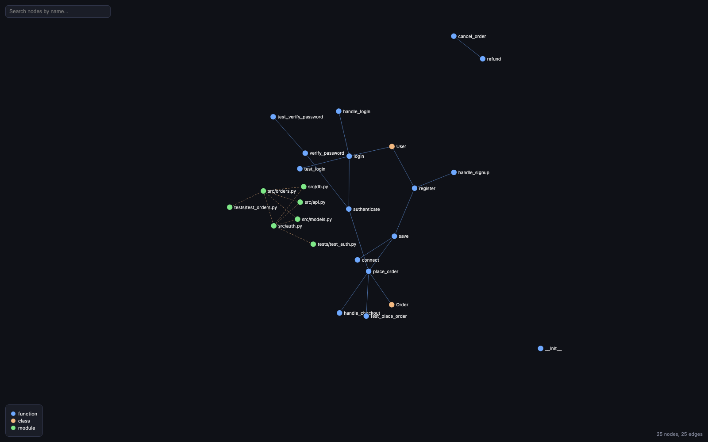

# claude-graph


A local knowledge graph of your codebase, built specifically for
**Claude Code on macOS**. Parses your repo with Tree-sitter, stores a
structural graph (functions, classes, calls, imports, test coverage) in
a local SQLite file, and exposes it to Claude Code over MCP so it can
answer "what calls this", "what would break if I change this file", and
"is this covered by a test" — without reading the whole repo.



## Why this exists, and what it deliberately doesn't do

Built for a corporate setting with one hard requirement: **everything
happens locally, with zero network calls, ever.**

- No cloud or local embeddings/semantic search. Claude Code itself is
  already the LLM in the loop — it reads the candidates this tool
  returns (keyword search + graph neighbors) and does the semantic
  reasoning itself. No vectors, no model downloads, no API calls.
- No hooks. Nothing runs automatically when you edit a file. You (or
  Claude Code) call `build_or_update_graph` explicitly.
- No multi-platform support. This only configures Claude Code. It won't
  touch Cursor, Windsurf, Zed, or anything else.
- No home-directory writes. Everything this tool writes lives inside
  the repository you run it in (`.claude-graph/`, `.mcp.json`,
  `.claude/skills/`).
- No telemetry, no daemon, no multi-repo registry.

See `tests/test_no_network.py` for the automated proof: it runs a full
build + query + impact + search + viz + MCP server startup cycle with
outbound sockets disabled and asserts nothing tries to connect anywhere.

## Contents

- [Requirements](#requirements)
- [Install](#install)
- [CLI](#cli)
- [MCP tools](#mcp-tools)
- [Graph visualization](#graph-visualization)
- [Supported languages](#supported-languages)
- [How calls are resolved](#how-calls-are-resolved)
- [Search behavior](#search-behavior)
- [Known limitations](#known-limitations)
- [For teammates installing this themselves](#for-teammates-installing-this-themselves)
- [Releasing (maintainers)](#releasing-maintainers)

## Requirements

- macOS
- Python 3.11+
- git

## Install

```bash
pip install claude-graph
```

GitHub Packages doesn't support pip-installable Python packages directly
(only npm, Docker, Maven, Gradle, NuGet, and RubyGems are native registry
types there), so if you'd rather install straight from this repo without
going through PyPI, each
[release](https://github.com/mohansagark/claude-graph/releases) also ships
the wheel as a downloadable asset:

```bash
pip install https://github.com/mohansagark/claude-graph/releases/download/v0.1.0/claude_graph-0.1.0-py3-none-any.whl
```

Or from source, for local development or to track `main`:

```bash
git clone https://github.com/mohansagark/claude-graph.git
cd claude-graph
pip install -e .
```

### Docker

A container image is published to GitHub Container Registry on every
release — this *is* a real GitHub Package, unlike the two options above:

```bash
docker pull ghcr.io/mohansagark/claude-graph:latest
docker run --rm -v "$PWD:/repo" ghcr.io/mohansagark/claude-graph build
```

Every command mounts your repo at `/repo` and takes the same arguments as
the native CLI, e.g. `docker run --rm -v "$PWD:/repo" ghcr.io/mohansagark/claude-graph viz --symbol foo`.
Note this is more friction than `pip install` for day-to-day use — in
particular, wiring `claude-graph serve` up as Claude Code's MCP server via
Docker means `.mcp.json`'s command becomes a `docker run -v ...` invocation
instead of a bare binary, which is why `claude-graph install` (below)
generates the native-binary form by default. Docker is mainly useful when
you don't want a Python environment on the host at all.

Then, inside the project you want a graph for:

```bash
cd /path/to/your/project
claude-graph install   # writes .mcp.json and .claude/skills/ in that repo
claude-graph build      # parses the repo and writes .claude-graph/graph.db
```

Restart Claude Code (or run `/mcp` to confirm `claude-graph` is
connected) and ask it something structural, e.g. "what calls
`parse_file` in this repo?"

**Build first.** Calling any of the MCP query tools (`query_graph_tool`,
`get_impact_radius_tool`, `search_nodes_tool`) before a graph has ever
been built will not error — it silently returns empty results, and as a
side effect creates an empty `.claude-graph/graph.db` file. Run
`claude-graph build` (or let Claude Code call `build_or_update_graph`
first) before expecting real answers.

## CLI

| Command | What it does |
|---|---|
| `claude-graph build` | Full parse of every git-tracked file |
| `claude-graph update` | Re-parses only changed files since the last build |
| `claude-graph status` | Prints node/edge/file counts |
| `claude-graph install` | Writes `.mcp.json` and `.claude/skills/` for this repo |
| `claude-graph serve` | Starts the MCP server (stdio) — Claude Code launches this itself |
| `claude-graph viz` | Render an interactive HTML graph view (`--symbol NAME` or `--impact FILE...` to scope it, `-o PATH` to change the output path) |

Every command accepts `--repo PATH` to target a repo other than the
current directory.

## MCP tools

| Tool | Purpose |
|---|---|
| `build_or_update_graph` | Full build if no graph exists, incremental update otherwise |
| `get_graph_stats` | Node/edge/file counts, languages detected |
| `query_graph_tool` | `callers_of` / `callees_of` / `imports_of` / `tests_for` / `file_summary` |
| `get_impact_radius_tool` | Blast radius of a set of changed files |
| `search_nodes_tool` | Keyword search over function/class names and signatures |
| `render_graph_tool` | Render the graph (or a scoped neighborhood) to a self-contained local HTML file |

## Graph visualization

`claude-graph viz` (or the `render_graph_tool` MCP tool) writes a single
self-contained HTML file to `.claude-graph/graph.html` — open it directly in
a browser via `file://`, no server involved. It embeds a vendored copy of
D3 (ISC license) directly into the file, so it works fully offline, same as
everything else in this tool. The screenshot above is real output — a small
demo app rendered with `claude-graph viz`, no scoping.

```bash
claude-graph viz                              # the whole graph
claude-graph viz --symbol NAME                # a function/class's direct
                                               # callers, callees, and its
                                               # file's imports
claude-graph viz --impact FILE [FILE...]      # the impact radius of those
                  [--depth N]                  # changed files, laid out
                                               # visually
claude-graph viz -o custom/path.html          # change the output path
```

Click a node to highlight its direct neighborhood and see its file/line in
a side panel; drag to reposition; scroll to zoom; type in the search box to
find a node by name. There's no node cap yet, so a whole-repo view on a very
large codebase (thousands of nodes) may render slowly — see
[Known limitations](#known-limitations).

## Supported languages

Python, JavaScript, TypeScript, TSX out of the box. Add more by
dropping a `.claude-graph/languages.toml` into your repo — see
`claude_graph/default_languages.toml` for the schema (extensions,
tree-sitter grammar name, and the node types that count as a
function/class/import/call for that grammar). No code change needed.

## How calls are resolved

- A `calls` edge's source (caller) is always a function-kind node —
  only functions/methods make calls in this graph.
- A `calls` edge's target prefers a function match; if no function with
  that name exists, it falls back to a class match (a call to a class
  name is treated as an instantiation, e.g. `Foo()`).
- One `calls` edge is recorded per call site. If the same function calls
  `bar()` twice, you get two edges — this is intentional, not a bug, so
  call counts reflect actual call-site frequency.

## Search behavior

- Search runs over SQLite FTS5 when available. Your query is split into
  tokens and each token is wrapped as a quoted phrase before being
  handed to FTS5 (e.g. `foo-bar baz` becomes `"foo-bar" "baz"`) —
  FTS5's own query operators (`AND`, `OR`, `NEAR`, prefix `*`, column
  filters, etc.) are **not** supported by design; special characters are
  treated as literal text, not syntax.
- If the local SQLite build lacks FTS5, search falls back to a `LIKE`
  query, with `%`, `_`, and `\` escaped so wildcard-like characters in
  your query are matched literally rather than interpreted as SQL
  wildcards.
- An empty or whitespace-only query returns `[]` immediately in both
  modes.

## Known limitations

- **Bare-name, coarse node model.** Nodes are keyed by `(file, kind,
  name)`, not by fully-qualified path — so two same-kind, same-named
  symbols in the *same file* (e.g. two methods named the same thing on
  two different classes in that file) collapse into a single graph
  node, and cross-file call resolution is a global name-heuristic: a
  call to `save()` is matched against every function named `save()` in
  the graph, not just the one actually in scope. Two files with a
  same-named function can therefore produce over-broad
  `callers_of`/`callees_of` results (or, in the same-file collision
  case, an under-broad merged one). This is a deliberate
  precision/recall trade-off for a tool whose answers are read by an
  LLM that can disambiguate from context — better to flag too much than
  miss a real caller. See the docstrings in `claude_graph/query.py` for
  where this shows up in each query function.
- `tests_for` linking is naming-convention only (`test_foo.py` /
  `foo_test.py` / `foo.spec.ts` / `foo.test.ts` matched against
  `foo.py` / `foo.ts`). Tests that don't follow one of these
  conventions aren't linked.
- Import resolution is best-effort path matching, not real module
  resolution — it won't follow `tsconfig.json` path aliases or Python
  namespace packages.
- Incremental `update` only re-links edges for files whose content
  changed. If you move a symbol to another file, calls into it from
  files you didn't touch keep pointing at the old resolution until the
  next full `claude-graph build`.
- `claude-graph viz`'s whole-graph view has no node cap. On a very large
  codebase this can be slow or cluttered in the browser; scope it with
  `--symbol` or `--impact` for a focused view instead. It can also pick
  up vendored/minified third-party files checked into the repo (e.g. a
  bundled `.js` library) as noisy, densely-connected nodes — exclude
  them via `.claude-graph/languages.toml` if that happens.

## For teammates installing this themselves

```bash
git clone https://github.com/mohansagark/claude-graph.git
cd claude-graph
python3 -m venv .venv && source .venv/bin/activate
pip install -e ".[dev]"
pytest
```

## Releasing (maintainers)

Publishing to PyPI is automated via
[`.github/workflows/publish.yml`](.github/workflows/publish.yml) using PyPI
Trusted Publishing (OIDC — no API token stored in this repo). Bump the
`version` in `pyproject.toml`, then cut a
[GitHub Release](https://github.com/mohansagark/claude-graph/releases/new);
publishing the release triggers the workflow, which builds the sdist/wheel
and uploads them to PyPI.

## License

[MIT](LICENSE)
